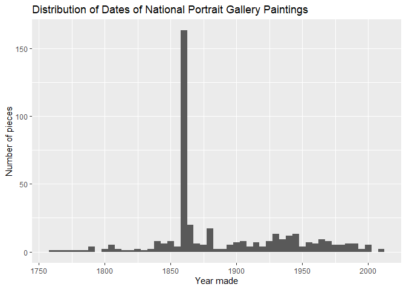

Portfolio-5
================
Natalie Frye
4/5/2021

``` r
library(tidyverse) 
```

    ## -- Attaching packages --------------------------------------- tidyverse 1.3.0 --

    ## v ggplot2 3.3.3     v purrr   0.3.4
    ## v tibble  3.1.0     v dplyr   1.0.3
    ## v tidyr   1.1.2     v stringr 1.4.0
    ## v readr   1.4.0     v forcats 0.5.1

    ## Warning: package 'tibble' was built under R version 4.0.4

    ## -- Conflicts ------------------------------------------ tidyverse_conflicts() --
    ## x dplyr::filter() masks stats::filter()
    ## x dplyr::lag()    masks stats::lag()

``` r
library(skimr)
```

``` r
npg_art <- read_csv("data/npg-art.csv")
```

Using my previous web-scraped data from the National Portrait Gallery, I
would now like to try to clean up the date column to get rid of some of
the extra stuff with the years.

``` r
npg_art <- npg_art %>%
  separate(date, into = c("date", "second_date"), sep = "\\-") %>%
  mutate(year_cleaned = str_remove(date,"c.") %>%
  as.numeric)
```

    ## Warning: Expected 2 pieces. Missing pieces filled with `NA` in 283 rows [1, 2,
    ## 3, 5, 6, 7, 8, 10, 13, 14, 15, 16, 21, 22, 23, 24, 25, 26, 27, 28, ...].

    ## Warning: Problem with `mutate()` input `year_cleaned`.
    ## i NAs introduced by coercion
    ## i Input `year_cleaned` is `str_remove(date, "c.") %>% as.numeric`.

``` r
skim(npg_art)
```

|                                                  |          |
|:-------------------------------------------------|:---------|
| Name                                             | npg\_art |
| Number of rows                                   | 465      |
| Number of columns                                | 7        |
| \_\_\_\_\_\_\_\_\_\_\_\_\_\_\_\_\_\_\_\_\_\_\_   |          |
| Column type frequency:                           |          |
| character                                        | 6        |
| numeric                                          | 1        |
| \_\_\_\_\_\_\_\_\_\_\_\_\_\_\_\_\_\_\_\_\_\_\_\_ |          |
| Group variables                                  | None     |

Data summary

**Variable type: character**

| skim\_variable | n\_missing | complete\_rate | min | max | empty | n\_unique | whitespace |
|:---------------|-----------:|---------------:|----:|----:|------:|----------:|-----------:|
| title          |          0 |           1.00 |   3 |  56 |     0 |       398 |          0 |
| artist         |          7 |           0.98 |   5 |  47 |     0 |       192 |          0 |
| medium         |          0 |           1.00 |   4 |  21 |     0 |        11 |          0 |
| location       |          0 |           1.00 |  25 |  25 |     0 |         1 |          0 |
| date           |         12 |           0.97 |   4 |  35 |     0 |       192 |          0 |
| second\_date   |        295 |           0.37 |   4 |  44 |     0 |        20 |          0 |

**Variable type: numeric**

| skim\_variable | n\_missing | complete\_rate |    mean |    sd |   p0 |  p25 |  p50 |     p75 | p100 | hist  |
|:---------------|-----------:|---------------:|--------:|------:|-----:|-----:|-----:|--------:|-----:|:------|
| year\_cleaned  |         43 |           0.91 | 1888.48 | 49.54 | 1762 | 1860 | 1862 | 1930.75 | 2012 | ▁▇▃▃▂ |

The most common extra thing in the dates column was a “c.” and a range
of dates, so I separated the dates ranges into two columns because I was
only interested in the first one, and then removed the “c.” from the new
dates. Now, only 43 dates are missing out of the 465 pieces.

I think it would be interesting to look at the descriptives of the dates
now that a lot more of them have been made into a format that I can
examine them in.

``` r
npg_art %>%
  summarize(
    mean_year = mean(year_cleaned, na.rm = TRUE),
    sd_year = sd(year_cleaned, na.rm = TRUE),
    min_year = min(year_cleaned, na.rm = TRUE),
    max_year = max(year_cleaned, na.rm = TRUE)
  )
```

    ## # A tibble: 1 x 4
    ##   mean_year sd_year min_year max_year
    ##       <dbl>   <dbl>    <dbl>    <dbl>
    ## 1     1888.    49.5     1762     2012

Now, the mean year is 1888, which is earlier than it was before fixing
these dates (1913), the sd is 49.5 years (was 60 before), and the
earliest piece is from 1762, and the max from 2012 (both the same as
before).

Finally, I’d like to vizualise these.

``` r
ggplot(data = npg_art,
       mapping = aes(x = year_cleaned)) +
  geom_histogram(binwidth = 5) +
  labs(title = "Distribution of Dates of National Portrait Gallery Paintings", 
       x = "Year made",
       y = "Number of pieces")
```

    ## Warning: Removed 43 rows containing non-finite values (stat_bin).

<!-- -->

From this, you can see that there’s one bin (of a width of 5 years) that
looks to be in the 1860s with way more pieces than the rest, which
wasn’t present when I plotted these dates before cleaning them up. My
hunch is that this is a time frame during the Civil War, which, as
previously noted, a lot of this museum’s collection centers around, and
that pieces from this time aren’t dated exactly, so many of them were
listed as “circa” whatever the time frame is, so now they’re all in the
same bin.

``` r
npg_art %>%
  count(year_cleaned, sort = TRUE)
```

    ## # A tibble: 134 x 2
    ##    year_cleaned     n
    ##           <dbl> <int>
    ##  1         1860   145
    ##  2           NA    43
    ##  3         1880    14
    ##  4         1861    11
    ##  5         1863     8
    ##  6         1864     8
    ##  7         1851     6
    ##  8         1945     6
    ##  9         1840     5
    ## 10         1862     5
    ## # ... with 124 more rows

The year is 1860, which makes sense with my theory.
